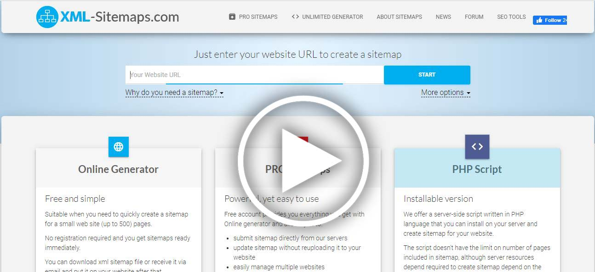
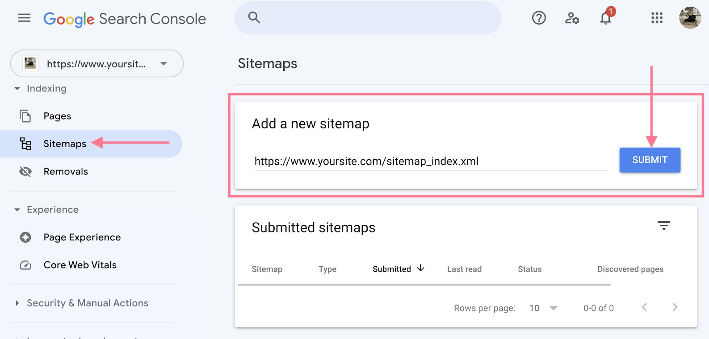
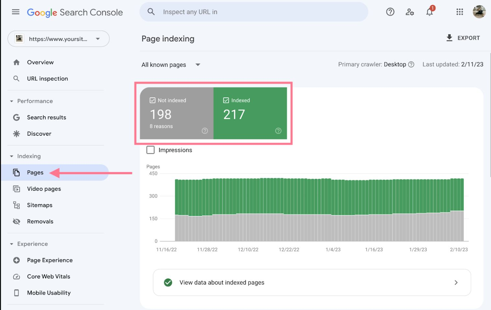

<h1>How to Optimize Web Pages for the Target Keyword </h1>


#### 1) Wrap Your Blog Post Title in an H1 Tag


#### 2) Wrap Subheadings in H2 Tags

<p>
Include your target keyword in at least one subheading. 
And wrap that subheading in an H2 tag.
</p>

#### 3) Keyword Frequency

<p>
Keyword Frequency is just like it sounds: It’s how many times your keyword appears in your content.
</p>

<p>
Try not to repeat the keyword phrase more than two times per page
</p>

#### 4) Use External (Outbound) Links

<p>External links are links on your site that point to other sites.</p>

<p>
A link (also known as a backlink) is a hyperlink that will direct a user from one page to another target page when clicked. 
Applied to a page by adding code like this:
</p>

```html

 <a href="http://www.domain.com/">target keyword</a>

```

<p>
An external link is any hyperlink or backlink, 
that points to a target page on another domain from the domain it’s published on. 
It’s external to the host domain.
</p>

#### 5) Add Internal Links

<ul>
   <li> 
   They help search engines understand your site’s structure and 
   how pages are related to each other
   </li>
  <li>
   They allow Google crawlers to discover and navigate to new pages
  </li>
  <li>
   They signal to Google that the linked-to page is valuable
  </li>
  <li>
   They help users navigate through your website (and keep them on your site longer)
  </li>
</ul>


#### 6) Front-load Your Title tag

<p> title tag is the most important on-page SEO factor</p>
<p>title tag gives search engines a high-level overview of what your page is all about</p>

#### 7) Use Unique, Keyword-Rich Meta Descriptions


#### 8) Image Optimization

<p>You want to give every image on your site a 
descriptive filename and alt text.</p>

<hr>

## Tips on Using Keywords

<h3> Put keywords in </h3>

<ul>
   <li>Title tags</li>
   <li>Description tags</li>
   <li>Alt image tags</li>
   <li>H1 (heading 1) tags</li>
   <li>Towards the front of a paragraph/sentence</li>
</ul>

<ul>
   <li>Use synonyms/variations of the keywords</li>
   <li>Optimize each page for only 1-2 keywords – max</li>
   <li>Try not to repeat the keyword phrase more than two times per page</li>
   <li>Google likes long-form content – so try and write around 1,500 words per page</li>
</ul>


## Sitemap

<p>
A sitemap is a file that lists all the important pages on a website. It guides search engines in determining which pages to include in their index.
</p>

<p>
Having a sitemap is an important part of SEO. Sitemaps help Google discover your pages faster and more effectively.
</p>


<p>
   An XML sitemap is a way to show search engines (like Google) 
   the most important pages on your site. 
</p>

## Best XML Sitemap Generators

<p>
How to generate or create Sitemap and add google search console
</p>


[](https://www.youtube.com/watch?v=m-DU_wlHgTo "How to generate or create Sitemap file for any website")

<hr>

[](https://www.youtube.com/watch?v=eX9AjP59iV4 "How to generate or create Sitemap file for any website")

<ul>
    <li><a href="https://www.xml-sitemaps.com/">https://www.xml-sitemaps.com/</a></li>
    <li><a href="https://www.inspyder.com/products/SitemapCreator">https://www.inspyder.com/products/SitemapCreator</a></li>
    <li><a href="http://www.sitemapwriter.com/">http://www.sitemapwriter.com/</a></li>
</ul>

##  Google Search Console?

<ul>
   <li>Review how your site is performing on Google</li>
   <li>See which pages Google can find and index on your site</li>
   <li>Submit sitemaps and individual URLs for crawling</li>
   <li>Identify technical SEO errors</li>
</ul>

### Add a Sitemap to Google Search Console

<p>
A sitemap file includes all the website URLs you want Google to crawl and index.
This is important because Google needs to crawl and index your pages in order to rank them.
</p>



### Page Indexing Report

<p>
The “Page indexing” report is located under the “Indexing” section. 
It shows you which pages Google can find and index, plus any related issues. 
</p>





